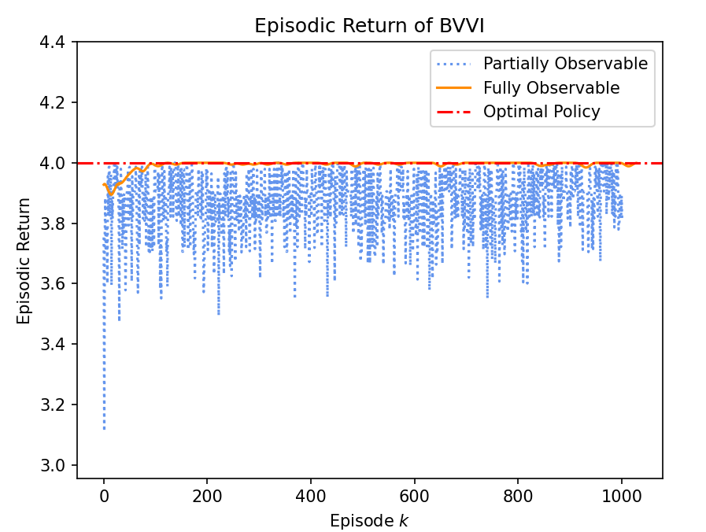
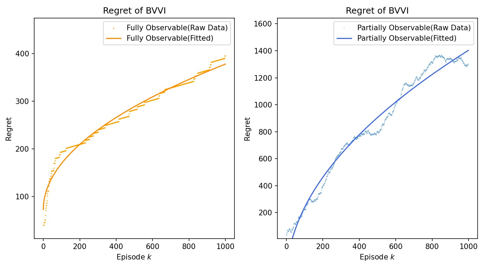
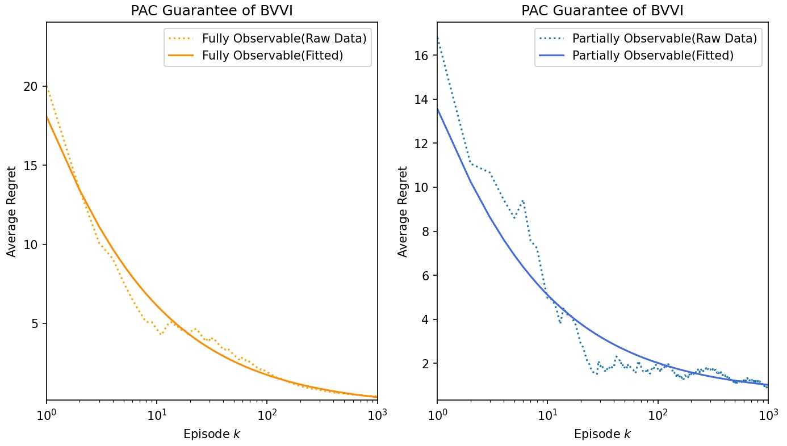

# Risk-POMDP Experimental Report

## Experimental results

In the experiment we tested three  things: 

1. The accumulated returns of each episode: to test whether the algorithm finds the optimal policy

2. The regret: to verify that the regret of our algorithm scales up at the speed of $\sqrt{K}$

3. The PAC guarantee: to check that the regret of the uniform mixture of the output policies converges to zero at the speed of $\frac{1}{\sqrt{K}}$

   

### Metric 1: Episodic Return

$$
\text{Episodic Return of Policy $\pi^k$}:= ~
\frac{1}{\gamma}\ln \mathbb{E}^{\pi^k}_{\mathcal{P}}\left[e^{\sum_{h=1}^{H}~r_{h}(S_h,A_h)}\right]
$$

We will calculate the ensemble average of the episodic return running BVVI on MDP/POMDP data. 

Vertical axis corresponds to $\frac{1}{\gamma}\ln \mathbb{E}^{\pi^k}_{\mathcal{P}}\left[e^{\sum_{h=1}^{H}~r_{h}(S_h,A_h)}\right]$, horizontal axis represents the episode number $k$. 




**Comments:**

1. POMDP has greater variance. The original data is very, very noisy, so I filtered the signal twice to make it smoother: first I applied a max pooling to the adjacent points to keep the highest returns and discard the extremely low rewards, then I adopt hamming window filtering to polish the curves. 
2. MDP setting converges a lot more faster than POMDP setting.


## Metric 2: Regret

The regret is defined as
$$
\operatorname{Regret}(K ; \mathcal{P}, \gamma):=\sum_{k=1}^K J\left(\pi^{\star} ; \mathcal{P}, \gamma\right)-J\left(\widehat{\pi}^k ; \mathcal{P}, \gamma\right), \\
\text{where}~J(\pi;\mathcal{P},\gamma):=\frac{1}{\gamma}\ln \mathbb{E}^{\pi}\left[
e^{\gamma \sum_{h=1}^H ~r_h(S_h,A_h)}\right]
$$
On page 5 of the original paper we proved that the regret of BVVI scales at the speed of $\sqrt{K}$:  

**Theorem 6.1. (Regret) With probability at least $1-4 \delta$, algorithm 1 achieves the following regret upper bound:**
$$
\operatorname{Regret}({\color{red}{K}} ; \mathcal{P}, \gamma)=\mathcal{O}\bigg(\underbrace{\frac{e^{|\gamma| H}-1}{|\gamma| H}}_{\text {risk awareness }} \underbrace{H^2 {\color{red}\sqrt{{K}}}\sqrt{ S^2 A O}}_{\text {Statistical error }} \underbrace{\sqrt{H \ln \frac{K H S O A}{\delta}}}_{\text {History-dependency }}\bigg)
$$
The experiment result coincides with our finding.



**Comments:**

We plot the raw data in dot lines and draw the fitted curves in solid line. 

We use
$$
f(x)=a\sqrt{bx+c}+d
$$
to fit the original signals. 


## Metric 3: PAC Guarantee

We also obtained the a sample complexity guarantee for BVVV on page 5 of the paper:

**Corollary 6.2. (Sample complexity) For algorithm 1 , the uniform mixture of its output policies ensures**
$$
\mathbb{P}\left(V^{\star}-\frac{1}{K} \sum_{k=1}^K V^{\widehat{\pi}^k}<\epsilon\right) \geq 1-\delta
$$
**when episode number $K$ satisfies**
$$
{\color{red}{K}} \gtrsim \frac{1}{{\color{red}{\epsilon^2 }}\delta^2}\left(\frac{e^{|\gamma| H}-1}{|\gamma| H}\right)^2 \cdot H^5 S^2 O A \cdot \ln \left(\frac{K H S O A}{\delta}\right)
$$
We call the quantity in the brackets of the probability measure as the ‘’average regret‘’:
$$
\text{Average Regret}(k):=~
J(\pi^\star;\mathcal{P},\gamma) -\frac{1}{k}\sum_{t=1}^{k}J(\pi^k;\mathcal{P},\gamma), \\
\text{where}~ J(\pi;\mathcal{P},\gamma):=\frac{1}{\gamma}\ln \mathbb{E}^{\pi}\left[
e^{\gamma \sum_{h=1}^H ~r_h(S_h,A_h)}\right]
$$
Our experiment also validates the finding that the sample complexity and the optimality follows the inverse square law, or equivalently, the optimality of output policies $\epsilon$ improves at the speed of $\tilde{O}\left(\frac{1}{\sqrt{K}}\right)$: 




**Comments:**

1. We fitted the curves with polynomial function of
   $$
   a\cdot\frac{1}{\sqrt{bx+c}}+d
   $$
   to show that our average regret converges at the speed of $\tilde{O}\left(\frac{1}{\sqrt{K}}\right)$. 

2. The raw data is plotted in dots and the fitted curves are in solid line.

3. POMDP has significantly higher noise than the MDP case.

4. In the original scale the two curves converges quite fast, so I plotted the diagrams in semi-logarithm scale.


## Experimental Setup

### Hyper Parameters

```yaml
sizes:
  size_of_action_space: 2
  size_of_state_space: 3
  size_of_observation_space: 3
  horizon_len: 4
  num_episode: 1000
  confidence_level: 0.2
  risk_sensitivity_factor: 1.0
```

### Environment Setting

#### Initial distribution:

$$
\mu(\cdot)=[1,0,0]
$$

we start from state 0 almost surely. 

```python
mu_true=torch.tensor([1,0,0])
```


#### Transition Matrices

We assume stationary transition. The transition law is almost deterministic.

```python
T_true=torch.stack([torch.tensor([[0.03,0.04,0.89],
                                  [0.95,0.02,0.10],
                                  [0.02,0.94,0.01]]).to(torch.float64).unsqueeze(-1).repeat(1,1,2)
                    for for _ in range(H)])
T_true=Normalize_T(T_true)
```

#### Emission Matrices

We assume stationary emission. In the experiments we consider both partially observable environment, when the emission is random, and the fully observable setting, in which the emission matrices are identity matrices that reveals the hidden states directly. 

```python
if identity_emission==False:
    O_true=torch.stack([
        torch.tensor([[0.83,0.05,0.02],
                      [0.08,0.79,0.09],
                      [0.09,0.06,0.89]]).to(torch.float64).transpose(0,1).repeat(1,1)
        for _ in range(H+1)])
    O_true=Normalize_O(O_true)
else:
    O_true=torch.eye(3).unsqueeze(0).repeat(H+1,1,1)
```

#### Rewards

Rewards are functions of the hidden states and actions.

```python
R_true=torch.tensor([[1,0],[0,1],[1,0]]).unsqueeze(0).repeat(H,1,1)
```


### Optimal Value

MDP: theoretical value

$V^\star=H$

POMDP: the theoretical optimal value is not known, even for deterministic policies.

We can brutally traverse all the policies, however under current setting a single PC is unable to do the job, because there are in total  $A^{\sum_{h=1}^H O^hA^{h-1}}=7.9488926326×10^{233}$   different kinds of policies even in our current setting. 

However, if we assume that BVVI algorithm is correctly written, then our experiment  empirically shows that

$V^\star_{\mathcal{P}} \approx H*0.98$

which is slightly smaller than the MDP case. This is due to the fact that optimal policies of POMDP are in general stochastic, while our paper only discusses deterministic policies, which is a suboptimal policy class.


## Insights from the experiment

Experiment shows that deterministic transition allows the algorithm to quickly converge, while the more random the transition probabilities are, the harder our algorithm converges.

The same for the emission matrices.

Purely randomized transitions and emissions will make our algorithm almost impossible to converge: 3000 iters, 6 hours, did not converge.
The more peaky the reward distribution is, the faster BVVI converges.


## Source Codes

Clone from Github Repository:  https://github.com/Tonghe-Zhang/BVVI.git

Or run the following command in the command line of your Windows machine:

```python
gh repo clone Tonghe-Zhang/BVVI
```

