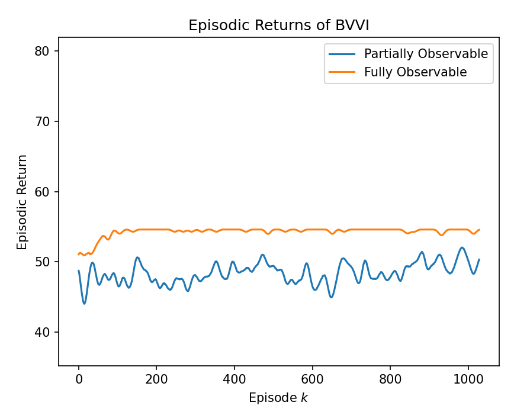
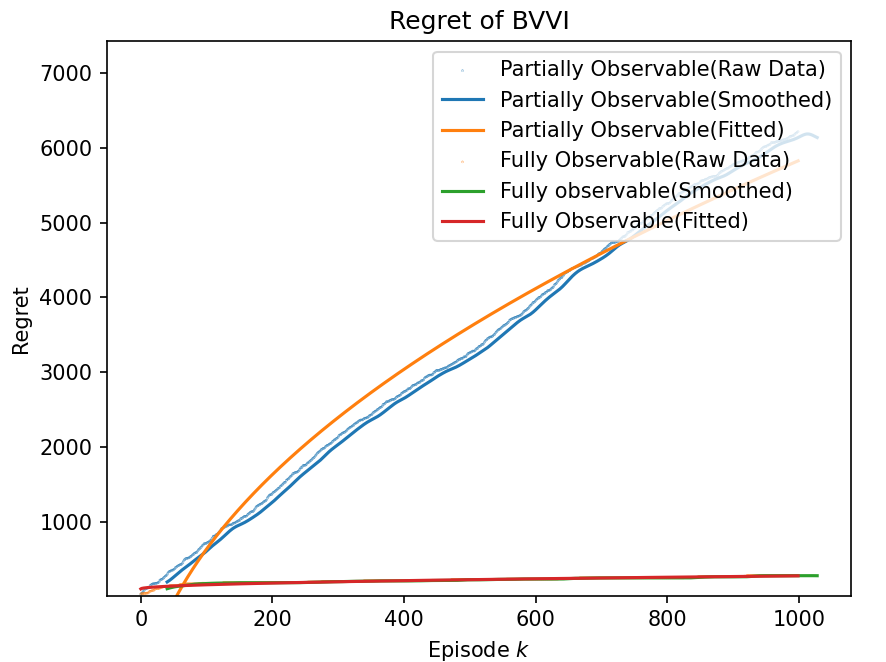
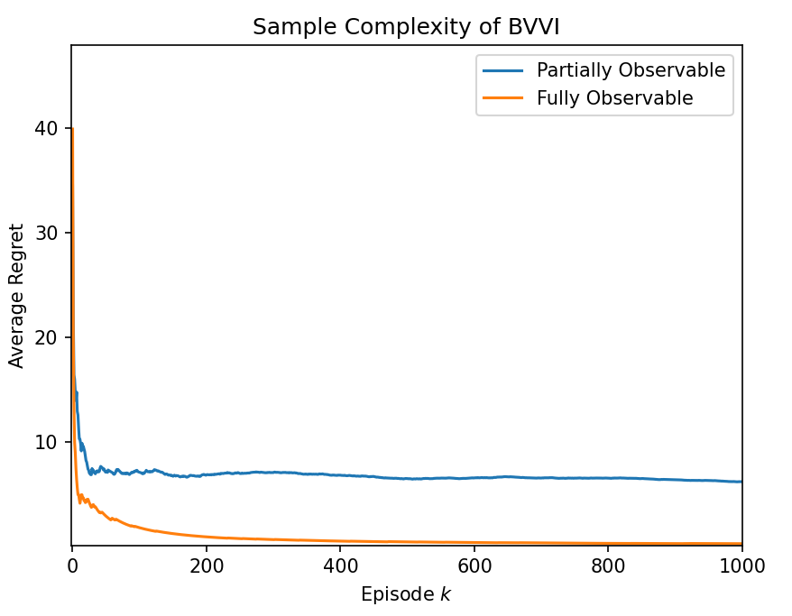

$$
J(\pi ; \mathcal{P}, \gamma):=\frac{1}{\gamma} \ln \mathbb{E}_{\mathcal{P}}^\pi\left[e^{\gamma \sum_{t=1}^H r_t\left(\boldsymbol{S}_{\boldsymbol{t}}, \boldsymbol{A}_{\boldsymbol{t}}\right)}\right]
$$

$$
\begin{aligned}
& \operatorname{Regret}(K ; \mathcal{P}, \gamma):=\sum_{k=1}^K J\left(\pi^{\star} ; \mathcal{P}, \gamma\right)-J\left(\widehat{\pi}^k ; \mathcal{P}, \gamma\right)\leq 48 \underbrace{\frac{e^{|\gamma| H}-1}{|\gamma|}}_{\text {Risk measure }}\cdot \underbrace{(\sqrt{K S}}_{\text {Prior error }}+\underbrace{H \sqrt{K S^2 A}}_{\text {Transition error }}+\underbrace{H \sqrt{K S O}}_{\text {Emission error }}+\underbrace{H \sqrt{K})}_{\text {Empirical bias }}
\cdot \underbrace{\sqrt{H \cdot \ln \frac{K H S O A}{\delta}}}_{\text {History-dependency }}
\\
\end{aligned}
$$

$$
\forall \ K \gtrsim \frac{1}{\epsilon^2 \delta^2}\left(\frac{e^{|\gamma| H}-1}{|\gamma| H}\right)^2 \cdot H^5 S^2 O A \cdot \ln \left(\frac{K H S O A}{\delta}\right), \quad 
\mathbb{P}\left(J(\pi^\star ;\mathcal{P}, \gamma)-\frac{1}{k}\sum_{t=1}^k J(\widehat{\pi}^t;\mathcal{P}, \gamma)\lt \epsilon \right) \gt 1-\delta
$$

Run this command to check the shapes:

for h in range(H+1):
    print(sigma_hat[h].shape)

    torch.Size([4, 2])
    torch.Size([4, 2, 4, 2])
    torch.Size([4, 2, 4, 2, 4, 2])
    torch.Size([4, 2, 4, 2, 4, 2, 4, 2])
    torch.Size([4, 2, 4, 2, 4, 2, 4, 2, 4, 2])
    torch.Size([4, 2, 4, 2, 4, 2, 4, 2, 4, 2, 4, 2])

for h in range(H+1):
    print(beta_hat[h].shape)

    torch.Size([4, 2])
    torch.Size([4, 2, 4, 2])
    torch.Size([4, 2, 4, 2, 4, 2])
    torch.Size([4, 2, 4, 2, 4, 2, 4, 2])
    torch.Size([4, 2, 4, 2, 4, 2, 4, 2, 4, 2])
    torch.Size([4, 2, 4, 2, 4, 2, 4, 2, 4, 2, 4, 2])

for h in range(H):
    print(Q_function[h].shape)

    torch.Size([4, 2])
    torch.Size([4, 2, 4, 2])
    torch.Size([4, 2, 4, 2, 4, 2])
    torch.Size([4, 2, 4, 2, 4, 2, 4, 2])
    torch.Size([4, 2, 4, 2, 4, 2, 4, 2, 4, 2])

for h in range(H):
    print(value_function[h].shape)

    torch.Size([4])
    torch.Size([4, 2, 4])
    torch.Size([4, 2, 4, 2, 4])
    torch.Size([4, 2, 4, 2, 4, 2, 4])
    torch.Size([4, 2, 4, 2, 4, 2, 4, 2, 4])

test_policy():
    @ h=0, policy[0].shape=torch.Size([4, 2])
    @ h=1, policy[1].shape=torch.Size([4, 2, 4, 2])
    @ h=2, policy[2].shape=torch.Size([4, 2, 4, 2, 4, 2])
    @ h=3, policy[3].shape=torch.Size([4, 2, 4, 2, 4, 2, 4, 2])      
    @ h=4, policy[4].shape=torch.Size([4, 2, 4, 2, 4, 2, 4, 2, 4, 2])

