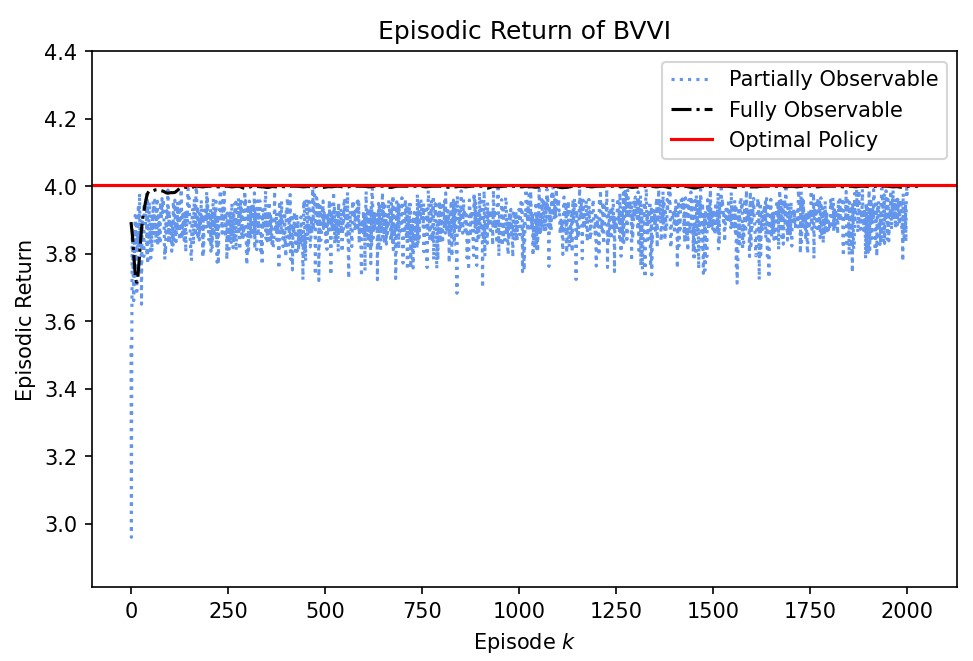
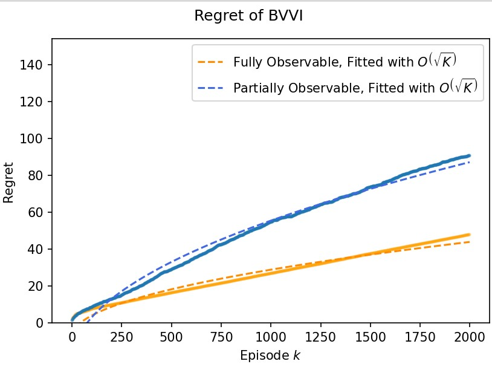
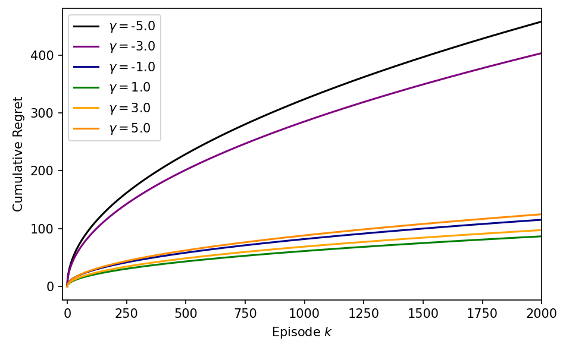
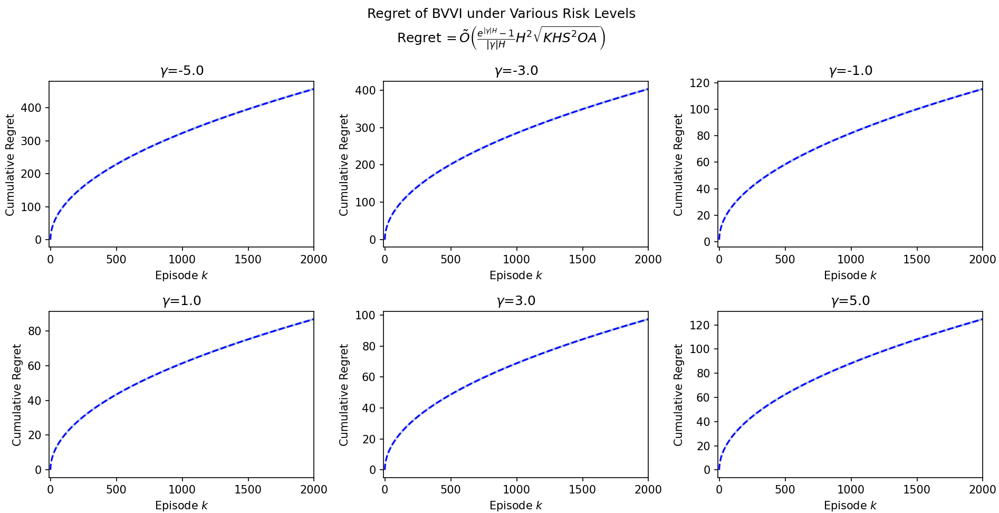
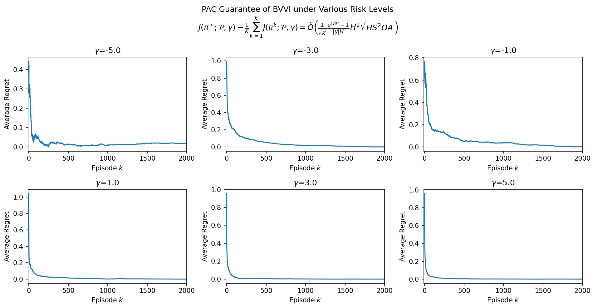

## Experimental Setup

### Hyper Parameters

```yaml
sizes:
  size_of_action_space: 2
  size_of_state_space: 3
  size_of_observation_space: 3
  horizon_len: 4
  num_episode: 2000
  confidence_level: 0.2
  risk_sensitivity_factor: 1.0 (default, later scanned in -5.0,-3.0,-1.0,1.0,3.0,5.0)
```

### Environment Setting

#### Initial distribution:

$$
\mu(\cdot)=[1,0,0]
$$

we start from state 0 almost surely. 

```python
mu_true=torch.tensor([1,0,0])
```


#### Transition Matrices

We assume stationary transition. The transition law is almost deterministic.

```python
T_true=torch.stack([torch.tensor([[0.03,0.04,0.89],
                                  [0.95,0.02,0.10], 			    [0.02,0.94,0.01]]).to(torch.float64).unsqueeze(-1).repeat(1,1,2)
                    for for _ in range(H)])
T_true=Normalize_T(T_true)
```

#### Emission Matrices

We assume stationary emission. In the experiments we consider both partially observable environment, when the emission is random, and the fully observable setting, in which the emission matrices are identity matrices that reveals the hidden states directly. 

```python
if identity_emission==False:
    O_true=torch.stack([
        torch.tensor([[0.83,0.05,0.02],
                      [0.08,0.79,0.09],
                      [0.09,0.06,0.89]]).to(torch.float64).transpose(0,1).repeat(1,1)
        for _ in range(H+1)])
    O_true=Normalize_O(O_true)
else:
    O_true=torch.eye(3).unsqueeze(0).repeat(H+1,1,1)
```

#### Rewards

Rewards are functions of the hidden states and actions.

```python
R_true=torch.tensor([[1,0],[0,1],[1,0]]).unsqueeze(0).repeat(H,1,1)
```


## Experimental results(new)













